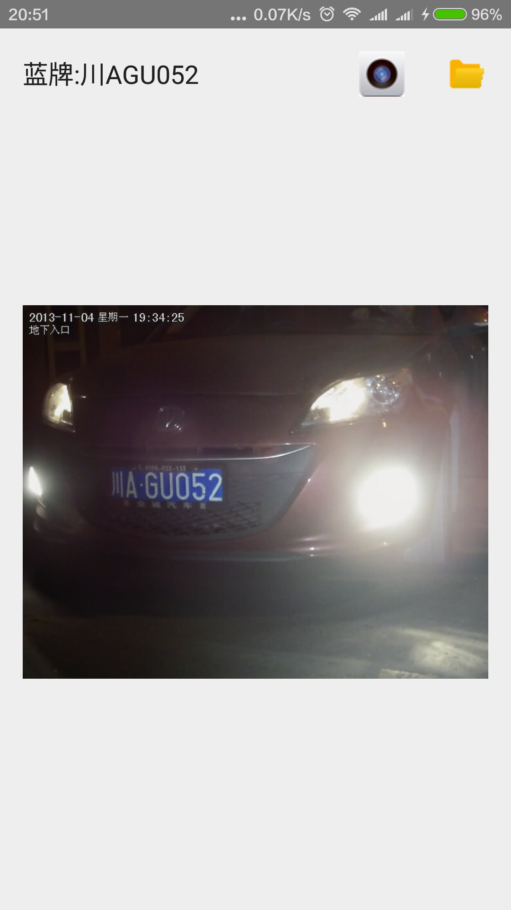

## 基于EasyPR的车牌识别android实现

EasyPR4Android，基于[EasyPR](https://github.com/liuruoze/EasyPR)1.5beta的android实现

### 更新：

* 添加编译好的[安装文件](mrcar.apk)

* 采用android studio2.3.3大幅简化ndk开发的配置

### 特性：

* 1.支持拍照和支持图库浏览识别

* 2.ndk调用OpenCV

* 3.从assets读取并复制文件

* 4.采用多线程进行识别处理

* 5.支持单击进行原图和识别结果之间的切换

采用android studio2.3.3开发实现，ndk版本为R12d，OpenCV版本为3.2，android SDK版本为25。

app启动时会默认从assets加载测试图片，并进行识别，返回结果。点击相机按钮进行拍照识别，点击文件夹按钮从图库选择文件进行识别（兼容android 4.4版本及以上）。

### 编译方法：

* 1.下载并配置[android studio 2.3.3](http://www.android-studio.org/)

* 2.安装编译环境[ndk r12d](http://blog.csdn.net/shuzfan/article/details/52690554)

* 3.配置opencv库，opencv4android3.2
使得解压后的OpenCV-android-sdk与本工程根目录处于同一级目录

* 4.编译并运行，也可以直接下载编译好的[apk](mrcar.apk)安装使用

### 参考：

* 1.[Android Studio 开发opencv3应用](https://wenku.baidu.com/view/8665a8efcc17552706220881)

* 2.[Android Studio 2.2 更方便地创建JNI项目-CMake](http://www.jianshu.com/p/4eefb16d83e3)

* 3.[Android 使用OpenCV的三种方式(Android Studio)](http://blog.csdn.net/sbsujjbcy/article/details/49520791)

* 4.[NDK-JNI实战教程](http://blog.csdn.net/yanbober/article/details/45309049)

* 5.[在Android Studio上进行OpenCV 3.1开发
](http://johnhany.net/2016/01/opencv-3-development-in-android-studio/)
